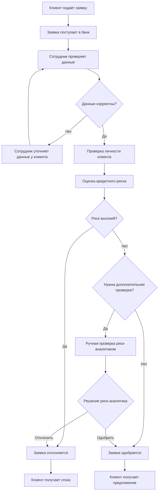
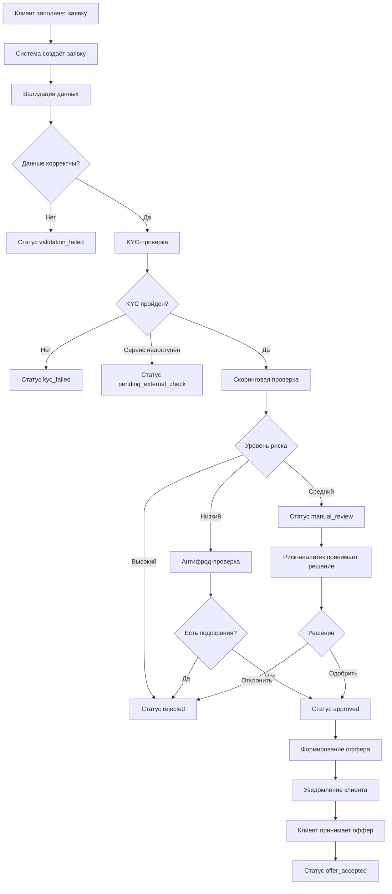
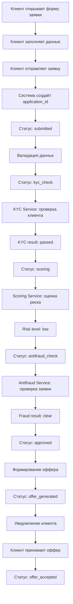

# AS-IS / TO-BE процесс

## 1. Цель документа

Этот документ описывает текущий и целевой процесс обработки заявки на кредитную карту в рамках проекта **Digital Bank Credit Decision Platform** для условного цифрового банка NovaBank.

Документ нужен, чтобы:

- зафиксировать текущие проблемы процесса;
- описать целевой процесс после автоматизации;
- показать различия между AS-IS и TO-BE;
- определить, какие изменения должна поддерживать проектируемая система;
- подготовить основу для BPMN-диаграммы, бизнес-правил, требований и модели статусов.

---

## 2. Контекст процесса

NovaBank принимает заявки на кредитные карты через цифровые каналы: сайт и мобильное приложение.

В текущем процессе часть проверок выполняется вручную или полуручно. Это увеличивает время обработки заявки, создаёт нагрузку на сотрудников и усложняет контроль качества принятия решений.

Целевой процесс должен автоматизировать основные этапы обработки заявки:

- создание заявки;
- валидацию данных;
- KYC-проверку;
- скоринг;
- антифрод-проверку;
- принятие решения;
- ручную проверку спорных заявок;
- формирование оффера;
- уведомление клиента;
- хранение истории статусов и audit log.

---

# 3. AS-IS процесс

## 3.1 Краткое описание AS-IS

В текущем процессе клиент подаёт заявку на кредитную карту, после чего часть данных проверяется вручную сотрудниками банка. Информация может передаваться между несколькими системами, а статус заявки не всегда прозрачен для клиента и внутренних пользователей.

Процесс зависит от ручных действий сотрудников, поэтому решение по заявке может занимать много времени.

---

## 3.2 Участники AS-IS процесса

| Участник | Роль в текущем процессе |
|---|---|
| Клиент | Подаёт заявку на кредитную карту |
| Сотрудник поддержки | Может уточнять данные клиента и отвечать на вопросы |
| Кредитный специалист | Проверяет заявку и передаёт её на дальнейшую обработку |
| Риск-аналитик | Рассматривает спорные или рискованные заявки |
| Служба безопасности | Проверяет подозрительные заявки |
| Кредитный менеджер | Анализирует результаты обработки заявок |
| Внешние сервисы | Используются для отдельных проверок, но не всегда интегрированы в единый процесс |

---

## 3.3 AS-IS процесс по шагам

| № | Шаг | Участник | Описание |
|---|---|---|---|
| 1 | Подача заявки | Клиент | Клиент заполняет форму заявки на сайте или в мобильном приложении |
| 2 | Первичная регистрация заявки | Система / сотрудник | Заявка создаётся в системе или передаётся на ручную обработку |
| 3 | Проверка данных | Сотрудник | Сотрудник проверяет корректность заполненных данных |
| 4 | Уточнение информации | Сотрудник поддержки | При необходимости сотрудник связывается с клиентом |
| 5 | Проверка личности | Сотрудник / внешний сервис | Данные клиента проверяются вручную или через отдельный сервис |
| 6 | Оценка кредитного риска | Риск-аналитик / скоринговая система | Выполняется оценка риска клиента |
| 7 | Антифрод-проверка | Служба безопасности | Подозрительные заявки проверяются дополнительно |
| 8 | Принятие решения | Сотрудник / риск-аналитик | Заявка одобряется, отклоняется или отправляется на дополнительную проверку |
| 9 | Уведомление клиента | Сотрудник / система | Клиент получает информацию о решении |
| 10 | Формирование предложения | Сотрудник / система | При одобрении формируется предложение по кредитной карте |

---

## 3.4 AS-IS схема процесса

---

## 3.5 Проблемы AS-IS процесса

| Проблема | Описание | Последствие |
|---|---|---|
| Высокая доля ручной обработки | Сотрудники вручную проверяют типовые заявки | Увеличивается время принятия решения |
| Непрозрачные статусы | Клиент и поддержка не всегда понимают, где находится заявка | Растёт количество обращений в поддержку |
| Разрозненные проверки | KYC, скоринг и антифрод могут выполняться в разных системах | Сложно отследить полный путь заявки |
| Недостаточная история изменений | Не всегда понятно, кто и почему изменил статус заявки | Сложнее расследовать ошибки |
| Нет единой модели статусов | Разные сотрудники могут по-разному трактовать состояние заявки | Возникают ошибки и недопонимание |
| Сложно анализировать воронку | Данные по заявкам не всегда собраны в единой системе | Бизнесу сложно принимать решения |
| Риск ошибок | Ручные действия увеличивают вероятность ошибки | Возможны некорректные решения по заявкам |
| Нет автоматической маршрутизации | Спорные заявки не всегда быстро попадают к нужному специалисту | Увеличивается SLA обработки |

---

## 3.6 Основные риски AS-IS процесса

| Риск | Возможное последствие |
|---|---|
| Заявка может долго находиться без движения | Клиент уходит к конкуренту |
| Сотрудник может принять решение без полной информации | Ошибочное одобрение или отказ |
| Подозрительная заявка может пройти проверку | Повышается риск мошенничества |
| История решения не сохраняется полностью | Сложно провести аудит |
| Клиент не получает своевременное уведомление | Ухудшается клиентский опыт |

---

# 4. TO-BE процесс

## 4.1 Краткое описание TO-BE

В целевом процессе заявка клиента обрабатывается единой цифровой платформой. Система автоматически выполняет валидацию данных, запускает KYC, скоринг и антифрод-проверку, принимает решение по заранее заданным бизнес-правилам и направляет спорные заявки на ручную проверку.

Клиент получает уведомления об изменении статуса, а сотрудники банка видят актуальную информацию в системе.

---

## 4.2 Участники TO-BE процесса

| Участник | Роль в целевом процессе |
|---|---|
| Клиент | Подаёт заявку и принимает оффер |
| Digital Bank Credit Decision Platform | Управляет процессом обработки заявки |
| KYC Service | Проверяет личность клиента |
| Scoring Service | Оценивает кредитный риск |
| Antifraud Service | Проверяет заявку на подозрительные признаки |
| Risk Analyst | Рассматривает заявки в статусе manual_review |
| Support Specialist | Просматривает статус заявки и помогает клиенту |
| Notification Service | Отправляет уведомления клиенту |
| Credit Manager | Анализирует показатели кредитной воронки |
| System Administrator | Управляет ролями и доступами |

---

## 4.3 TO-BE процесс по шагам

| № | Шаг | Участник | Описание |
|---|---|---|---|
| 1 | Открытие формы заявки | Клиент | Клиент открывает форму заявки на кредитную карту |
| 2 | Заполнение заявки | Клиент | Клиент вводит персональные данные, контакты, доход и желаемый лимит |
| 3 | Отправка заявки | Клиент | Клиент отправляет заявку |
| 4 | Создание заявки | Система | Система создаёт заявку и присваивает ей `application_id` |
| 5 | Валидация данных | Система | Система проверяет обязательные поля, формат данных, возраст и наличие активной заявки |
| 6 | KYC-проверка | KYC Service | Система отправляет данные клиента во внешний KYC-сервис |
| 7 | Обработка результата KYC | Система | Система сохраняет результат KYC и определяет следующий шаг |
| 8 | Скоринговая проверка | Scoring Service | Система отправляет заявку в скоринговый сервис |
| 9 | Обработка результата скоринга | Система | Система получает score value и risk level |
| 10 | Антифрод-проверка | Antifraud Service | Система проверяет заявку на подозрительные признаки |
| 11 | Автоматическое решение | Система | Система одобряет, отклоняет или отправляет заявку на ручную проверку |
| 12 | Ручная проверка | Risk Analyst | Риск-аналитик рассматривает спорную заявку |
| 13 | Формирование оффера | Система | При одобрении система формирует кредитный оффер |
| 14 | Уведомление клиента | Notification Service | Клиент получает уведомление о решении |
| 15 | Принятие оффера | Клиент | Клиент принимает или отклоняет оффер |
| 16 | Сохранение истории | Система | Все изменения статуса сохраняются в истории и audit log |

---

## 4.4 TO-BE схема процесса

---

## 4.5 Целевые улучшения TO-BE процесса

| Улучшение | Как реализуется |
|---|---|
| Сокращение времени обработки заявки | Автоматизация валидации, KYC, скоринга и антифрода |
| Прозрачность процесса | Единая модель статусов заявки |
| Снижение ручной нагрузки | Автоматическое решение по типовым заявкам |
| Контроль спорных заявок | Очередь `manual_review` для риск-аналитика |
| Улучшение клиентского опыта | Уведомления клиента об изменении статуса |
| Повышение безопасности | Антифрод-проверка и audit log |
| Контроль доступа | Ролевая модель и маскирование персональных данных |
| Аналитика процесса | Метрики по заявкам, отказам, одобрениям и ручной проверке |

---
# Main Happy Path

## 1. Назначение сценария

Main Happy Path описывает основной успешный сценарий обработки заявки на кредитную карту в системе **Digital Bank Credit Decision Platform**.

Этот сценарий показывает, как заявка проходит весь путь без ошибок, отказов и ручной проверки:

клиент подаёт заявку → система проверяет данные → KYC успешно пройден → скоринг показывает низкий риск → антифрод не находит подозрений → заявка одобряется → формируется оффер → клиент принимает оффер.

---

## 2. Участники сценария

| Участник | Роль в сценарии |
|---|---|
| Клиент | Заполняет и отправляет заявку, принимает оффер |
| Digital Bank Credit Decision Platform | Управляет процессом обработки заявки |
| KYC Service | Проверяет личность клиента |
| Scoring Service | Оценивает кредитный риск |
| Antifraud Service | Проверяет заявку на подозрительные признаки |
| Offer Service | Формирует кредитный оффер |
| Notification Service | Уведомляет клиента об изменении статуса |
| Database | Хранит заявку, результаты проверок, оффер и историю статусов |

---

## 3. Предусловия

Перед началом сценария должны выполняться следующие условия:

| ID | Предусловие |
|---|---|
| PRE-001 | Клиент открыл форму заявки на кредитную карту |
| PRE-002 | Клиент ранее не имеет активной заявки на кредитную карту |
| PRE-003 | KYC Service доступен |
| PRE-004 | Scoring Service доступен |
| PRE-005 | Antifraud Service доступен |
| PRE-006 | Система может сохранять заявку и изменения статусов |
| PRE-007 | Notification Service доступен для отправки уведомлений |

---

## 4. Основной успешный сценарий

| № | Шаг | Участник | Действие | Результат |
|---|---|---|---|---|
| 1 | Открытие формы | Клиент | Клиент открывает форму заявки на кредитную карту | Форма заявки отображается клиенту |
| 2 | Заполнение данных | Клиент | Клиент вводит ФИО, дату рождения, телефон, email, паспортные данные, доход и желаемый лимит | Данные введены в форму |
| 3 | Отправка заявки | Клиент | Клиент нажимает кнопку отправки заявки | Заявка передаётся в систему |
| 4 | Создание заявки | Система | Система создаёт заявку и присваивает `application_id` | Заявка создана |
| 5 | Установка статуса | Система | Система устанавливает статус `submitted` | Статус заявки сохранён |
| 6 | Валидация данных | Система | Система проверяет обязательные поля, формат данных, возраст и наличие активной заявки | Данные признаны корректными |
| 7 | Переход к KYC | Система | Система переводит заявку в статус `kyc_check` | Статус обновлён |
| 8 | Запрос KYC | Система → KYC Service | Система отправляет данные клиента в KYC Service | KYC-запрос отправлен |
| 9 | Получение KYC-результата | KYC Service → Система | KYC Service возвращает результат `passed` | Результат KYC сохранён |
| 10 | Переход к скорингу | Система | Система переводит заявку в статус `scoring` | Статус обновлён |
| 11 | Запрос скоринга | Система → Scoring Service | Система отправляет заявку в Scoring Service | Скоринговый запрос отправлен |
| 12 | Получение результата скоринга | Scoring Service → Система | Scoring Service возвращает `score_value` и `risk_level = low` | Результат скоринга сохранён |
| 13 | Переход к антифроду | Система | Система переводит заявку в статус `antifraud_check` | Статус обновлён |
| 14 | Запрос антифрода | Система → Antifraud Service | Система отправляет заявку в Antifraud Service | Антифрод-запрос отправлен |
| 15 | Получение результата антифрода | Antifraud Service → Система | Antifraud Service возвращает результат `clear` | Результат антифрода сохранён |
| 16 | Одобрение заявки | Система | Система принимает положительное кредитное решение | Заявка получает статус `approved` |
| 17 | Формирование оффера | Система / Offer Service | Система формирует оффер с лимитом, ставкой и сроком действия | Оффер создан |
| 18 | Обновление статуса | Система | Система переводит заявку в статус `offer_generated` | Статус обновлён |
| 19 | Уведомление клиента | Notification Service | Система отправляет клиенту уведомление об одобрении и доступном оффере | Клиент получил уведомление |
| 20 | Просмотр оффера | Клиент | Клиент открывает оффер | Условия оффера отображены клиенту |
| 21 | Принятие оффера | Клиент | Клиент принимает оффер | Оффер принят |
| 22 | Финальный статус | Система | Система переводит заявку в статус `offer_accepted` | Основной сценарий завершён |

---

## 5. Статусы заявки в рамках Main Happy Path

| № | Событие | Новый статус |
|---|---|---|
| 1 | Клиент отправил заявку | `submitted` |
| 2 | Система начала KYC-проверку | `kyc_check` |
| 3 | KYC успешно пройден | `scoring` |
| 4 | Скоринг вернул низкий риск | `antifraud_check` |
| 5 | Антифрод не выявил подозрений | `approved` |
| 6 | Система сформировала оффер | `offer_generated` |
| 7 | Клиент принял оффер | `offer_accepted` |

---

## 6. Данные, которые создаются в процессе

| Шаг | Какие данные создаются или обновляются |
|---|---|
| Создание заявки | `application_id`, данные клиента, канал подачи, дата создания |
| Валидация данных | результат проверки обязательных полей |
| KYC-проверка | результат KYC, дата проверки, внешний идентификатор проверки |
| Скоринг | `score_value`, `risk_level`, рекомендация скоринга |
| Антифрод | результат проверки, fraud indicators |
| Одобрение | кредитное решение, дата решения |
| Формирование оффера | approved limit, interest rate, offer valid until |
| Принятие оффера | статус оффера, дата принятия |
| Изменение статусов | запись в `application_status_history` |
| Действия системы | записи в `audit_log` |

---

## 7. Постусловия

После успешного завершения сценария:

| ID | Постусловие |
|---|---|
| POST-001 | Заявка имеет статус `offer_accepted` |
| POST-002 | Результат KYC-проверки сохранён |
| POST-003 | Результат скоринга сохранён |
| POST-004 | Результат антифрод-проверки сохранён |
| POST-005 | Кредитный оффер создан и принят клиентом |
| POST-006 | История изменения статусов сохранена |
| POST-007 | Ключевые действия записаны в audit log |
| POST-008 | Клиент получил уведомление об одобрении заявки |

---

## 8. Mermaid-схема Main Happy Path

---

# 5. Сравнение AS-IS и TO-BE

| Критерий | AS-IS | TO-BE |
|---|---|---|
| Создание заявки | Заявка создаётся, но часть обработки зависит от сотрудников | Заявка создаётся автоматически с уникальным идентификатором |
| Валидация данных | Частично ручная | Автоматическая |
| KYC | Может выполняться отдельно от основного процесса | Интегрирован во flow обработки заявки |
| Скоринг | Частично автоматизирован или требует ручной интерпретации | Автоматически возвращает score и risk level |
| Антифрод | Может подключаться только для отдельных заявок | Запускается как обязательный этап для подходящих заявок |
| Ручная проверка | Не всегда формализована | Есть отдельный статус `manual_review` и очередь заявок |
| Статусы заявки | Могут быть неполными или неунифицированными | Единая модель статусов |
| Уведомления клиента | Могут отправляться с задержкой | Отправляются при ключевых изменениях статуса |
| История изменений | Может быть неполной | Сохраняется история статусов |
| Audit log | Может отсутствовать или быть неполным | Логируются ключевые действия |
| Аналитика | Данные сложно собрать | Метрики формируются на основе данных системы |
| Контроль доступа | Может быть недостаточно формализован | Используется ролевая модель доступа |

---

# 6. Основные изменения в процессе

## 6.1 Автоматизация проверок

В TO-BE процессе внешние проверки становятся частью единого автоматизированного flow.

Система сама инициирует:

- KYC-проверку;
- скоринговую проверку;
- антифрод-проверку.

Это снижает количество ручных действий и ускоряет обработку заявки.

---

## 6.2 Формализация статусов

В TO-BE процессе каждая заявка имеет один текущий статус.

Примеры статусов:

- `draft`;
- `submitted`;
- `validation_failed`;
- `kyc_check`;
- `kyc_failed`;
- `pending_external_check`;
- `scoring`;
- `antifraud_check`;
- `manual_review`;
- `approved`;
- `rejected`;
- `offer_generated`;
- `offer_accepted`;
- `cancelled`.

Полная модель статусов будет описана в отдельном документе.

---

## 6.3 Ручная проверка только для спорных заявок

В AS-IS процессе ручная проверка может использоваться слишком часто.

В TO-BE процессе ручная проверка применяется только в случаях, когда:

- скоринговый риск средний;
- антифрод-проверка дала спорный результат;
- внешний сервис вернул неоднозначные данные;
- требуется дополнительное решение риск-аналитика.

---

## 6.4 Хранение истории и audit log

В TO-BE процессе система должна сохранять:

- историю изменения статусов заявки;
- дату и время изменения;
- инициатора изменения;
- причину изменения;
- действия сотрудников;
- ошибки внешних сервисов.

Это необходимо для контроля, аудита и расследования спорных ситуаций.

---

## 6.5 Улучшение аналитики

TO-BE процесс позволяет собирать данные для анализа кредитной воронки.

Основные метрики:

- количество заявок;
- approval rate;
- rejection rate;
- manual review rate;
- average decision time;
- KYC failure rate;
- fraud rejection rate;
- offer acceptance rate;
- pending external check rate.

---

# 7. Бизнес-эффект TO-BE процесса

| Эффект | Описание |
|---|---|
| Снижение времени обработки | Большая часть заявок проходит автоматическую обработку |
| Снижение нагрузки на сотрудников | Ручная проверка используется только для спорных заявок |
| Рост прозрачности | Каждый этап фиксируется в статусах и истории |
| Улучшение клиентского опыта | Клиент получает своевременные уведомления |
| Улучшение контроля рисков | KYC, скоринг и антифрод становятся обязательными этапами |
| Повышение управляемости | Бизнес получает метрики по кредитной воронке |
| Снижение операционных ошибок | Меньше ручных действий и неформальных решений |

---

# 8. Требования, вытекающие из TO-BE процесса

На основе TO-BE процесса можно выделить следующие будущие требования:

| ID | Требование |
|---|---|
| REQ-001 | Система должна создавать заявку с уникальным `application_id` |
| REQ-002 | Система должна выполнять валидацию обязательных полей |
| REQ-003 | Система должна проверять наличие активной заявки у клиента |
| REQ-004 | Система должна отправлять данные клиента в KYC Service |
| REQ-005 | Система должна сохранять результат KYC-проверки |
| REQ-006 | Система должна отправлять заявку в Scoring Service |
| REQ-007 | Система должна сохранять score value и risk level |
| REQ-008 | Система должна отправлять заявку в Antifraud Service |
| REQ-009 | Система должна маршрутизировать заявку на основе результата проверок |
| REQ-010 | Система должна поддерживать статус `manual_review` |
| REQ-011 | Риск-аналитик должен иметь возможность принять ручное решение |
| REQ-012 | Система должна формировать оффер при положительном решении |
| REQ-013 | Система должна уведомлять клиента об изменении статуса |
| REQ-014 | Система должна хранить историю изменения статусов |
| REQ-015 | Система должна фиксировать ключевые действия в audit log |

Эти требования будут детализированы в документе `Functional_Requirements.md`.

---

# 9. Открытые вопросы

| ID | Вопрос | Кому адресован |
|---|---|---|
| Q-001 | Какие поля обязательны для подачи заявки? | Бизнес / продукт |
| Q-002 | Какие причины отказа можно показывать клиенту? | Compliance / юридический отдел |
| Q-003 | Какой SLA должен быть у KYC-проверки? | IT / внешний сервис |
| Q-004 | Какие значения risk level возвращает скоринговый сервис? | Риск-команда |
| Q-005 | Какие признаки считаются подозрительными для антифрода? | Служба безопасности |
| Q-006 | Как долго действует оффер? | Кредитный менеджер |
| Q-007 | Какие действия должны попадать в audit log? | Compliance / IT |
| Q-008 | Какие данные нужно маскировать для поддержки? | Compliance / безопасность |
| Q-009 | Какой максимальный срок нахождения заявки в `manual_review`? | Риск-команда |
| Q-010 | Нужно ли клиенту показывать промежуточные статусы заявки? | Продукт / поддержка |

---

# 10. Вывод

AS-IS процесс зависит от ручных действий, разрозненных проверок и неполной прозрачности статусов. Это увеличивает время обработки заявки, создаёт операционные риски и ухудшает клиентский опыт.

TO-BE процесс переводит обработку заявки в единую цифровую платформу, где основные проверки выполняются автоматически, спорные заявки направляются на ручную проверку, а все изменения фиксируются в истории и audit log.

Этот документ является основой для дальнейших артефактов проекта:

- BPMN-диаграммы;
- бизнес-правил;
- decision table;
- модели статусов;
- функциональных требований;
- sequence diagram;
- API-спецификации;
- ERD;
- тестовых сценариев.
